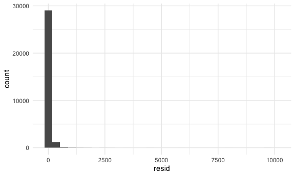
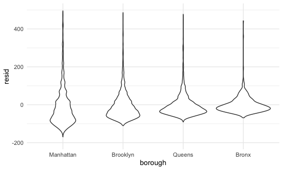
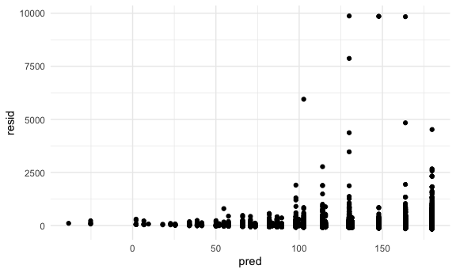
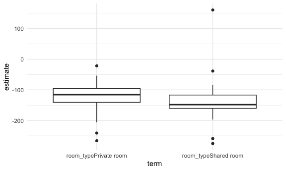

Linear Models
================

Load key packages.

``` r
library(tidyverse)
library(p8105.datasets)
```

Do some data cleaning.

``` r
data("nyc_airbnb")

nyc_airbnb =
  nyc_airbnb |> 
  mutate(stars = review_scores_location / 2) |> 
  rename(
    borough = neighbourhood_group, 
    neighborhood = neighbourhood
  ) |> 
  filter(
    borough != "Staten Island"
  ) |> 
  select(price, stars, borough, neighborhood, room_type) |> 
  mutate(
    borough = fct_infreq(borough),
    room_type = fct_infreq(room_type)
  )
```

## Fit some models

Start relatively simple.

``` r
fit = lm(price ~ stars, data = nyc_airbnb)

summary(fit)
```

    ## 
    ## Call:
    ## lm(formula = price ~ stars, data = nyc_airbnb)
    ## 
    ## Residuals:
    ##    Min     1Q Median     3Q    Max 
    ## -144.1  -69.1  -32.0   25.9 9889.0 
    ## 
    ## Coefficients:
    ##             Estimate Std. Error t value Pr(>|t|)    
    ## (Intercept)  -66.500     11.893  -5.591 2.27e-08 ***
    ## stars         44.115      2.515  17.538  < 2e-16 ***
    ## ---
    ## Signif. codes:  0 '***' 0.001 '**' 0.01 '*' 0.05 '.' 0.1 ' ' 1
    ## 
    ## Residual standard error: 183.8 on 30528 degrees of freedom
    ##   (9962 observations deleted due to missingness)
    ## Multiple R-squared:  0.009974,   Adjusted R-squared:  0.009942 
    ## F-statistic: 307.6 on 1 and 30528 DF,  p-value: < 2.2e-16

``` r
names(summary(fit))
```

    ##  [1] "call"          "terms"         "residuals"     "coefficients" 
    ##  [5] "aliased"       "sigma"         "df"            "r.squared"    
    ##  [9] "adj.r.squared" "fstatistic"    "cov.unscaled"  "na.action"

``` r
coef(fit)
```

    ## (Intercept)       stars 
    ##   -66.50023    44.11475

``` r
fit |> 
  broom::tidy() |> 
  select(term, estimate, p.value)
```

    ## # A tibble: 2 × 3
    ##   term        estimate  p.value
    ##   <chr>          <dbl>    <dbl>
    ## 1 (Intercept)    -66.5 2.27e- 8
    ## 2 stars           44.1 1.61e-68

``` r
fit |> 
  broom::glance()
```

    ## # A tibble: 1 × 12
    ##   r.squared adj.r.squared sigma statistic  p.value    df   logLik     AIC    BIC
    ##       <dbl>         <dbl> <dbl>     <dbl>    <dbl> <dbl>    <dbl>   <dbl>  <dbl>
    ## 1   0.00997       0.00994  184.      308. 1.61e-68     1 -202491. 404989. 4.05e5
    ## # ℹ 3 more variables: deviance <dbl>, df.residual <int>, nobs <int>

Try a bit more complex.

``` r
fit = 
  lm(price ~ stars + borough, data = nyc_airbnb)

fit |> 
  broom::tidy() |> 
  select(term, estimate, p.value) |> 
  mutate(
    term = str_replace(term, "borough", "Borough: ")
  ) |> 
  knitr::kable(digits = 3)
```

| term              | estimate | p.value |
|:------------------|---------:|--------:|
| (Intercept)       |   19.839 |   0.104 |
| stars             |   31.990 |   0.000 |
| Borough: Brooklyn |  -49.754 |   0.000 |
| Borough: Queens   |  -77.048 |   0.000 |
| Borough: Bronx    |  -90.254 |   0.000 |

## Some diagnostics

(backtrack to some EDA)

``` r
nyc_airbnb |> 
  ggplot(aes(x = stars, y = price)) +
  geom_point() +
  stat_smooth(method = "lm")
```

    ## `geom_smooth()` using formula = 'y ~ x'



Most diagnostics use residuals.

``` r
modelr::add_residuals(nyc_airbnb, fit) |> 
  ggplot(aes(x = resid)) +
  geom_histogram()
```

    ## `stat_bin()` using `bins = 30`. Pick better value with `binwidth`.



``` r
modelr::add_residuals(nyc_airbnb, fit) |> 
  ggplot(aes(x = borough, y = resid)) +
  geom_violin() +
  ylim(-200, 500)
```


Residuals against stars

``` r
modelr::add_residuals(nyc_airbnb, fit) |> 
  ggplot(aes(x = stars, y = resid)) +
  geom_point()
```



Residuals against fitted values

``` r
nyc_airbnb |> 
  modelr::add_residuals(fit) |> 
  modelr::add_predictions(fit) |> 
  ggplot(aes(x = pred, y = resid)) +
  geom_point()
```


## Hypothesis testing

for single coefficients, look at the table

``` r
fit |> 
  broom::tidy()
```

    ## # A tibble: 5 × 5
    ##   term            estimate std.error statistic   p.value
    ##   <chr>              <dbl>     <dbl>     <dbl>     <dbl>
    ## 1 (Intercept)         19.8     12.2       1.63 1.04e-  1
    ## 2 stars               32.0      2.53     12.7  1.27e- 36
    ## 3 boroughBrooklyn    -49.8      2.23    -22.3  6.32e-109
    ## 4 boroughQueens      -77.0      3.73    -20.7  2.58e- 94
    ## 5 boroughBronx       -90.3      8.57    -10.5  6.64e- 26

``` r
fit_null = lm(price ~ stars + borough, data = nyc_airbnb)
fit_alt = lm(price ~ stars + borough + room_type, data = nyc_airbnb)
```

Look at both

``` r
fit_null |> 
  broom::tidy()
```

    ## # A tibble: 5 × 5
    ##   term            estimate std.error statistic   p.value
    ##   <chr>              <dbl>     <dbl>     <dbl>     <dbl>
    ## 1 (Intercept)         19.8     12.2       1.63 1.04e-  1
    ## 2 stars               32.0      2.53     12.7  1.27e- 36
    ## 3 boroughBrooklyn    -49.8      2.23    -22.3  6.32e-109
    ## 4 boroughQueens      -77.0      3.73    -20.7  2.58e- 94
    ## 5 boroughBronx       -90.3      8.57    -10.5  6.64e- 26

``` r
fit_alt |> 
  broom::tidy()
```

    ## # A tibble: 7 × 5
    ##   term                  estimate std.error statistic  p.value
    ##   <chr>                    <dbl>     <dbl>     <dbl>    <dbl>
    ## 1 (Intercept)              113.      11.8       9.54 1.56e-21
    ## 2 stars                     21.9      2.43      9.01 2.09e-19
    ## 3 boroughBrooklyn          -40.3      2.15    -18.8  4.62e-78
    ## 4 boroughQueens            -55.5      3.59    -15.4  1.32e-53
    ## 5 boroughBronx             -63.0      8.22     -7.67 1.76e-14
    ## 6 room_typePrivate room   -105.       2.05    -51.2  0       
    ## 7 room_typeShared room    -129.       6.15    -21.0  2.24e-97

``` r
anova(fit_null, fit_alt) |> 
  broom::tidy()
```

    ## # A tibble: 2 × 7
    ##   term                        df.residual    rss    df   sumsq statistic p.value
    ##   <chr>                             <dbl>  <dbl> <dbl>   <dbl>     <dbl>   <dbl>
    ## 1 price ~ stars + borough           30525 1.01e9    NA NA            NA       NA
    ## 2 price ~ stars + borough + …       30523 9.21e8     2  8.42e7     1394.       0

## Do effects differ across boroughs

First, use a lost of interactions

``` r
nyc_airbnb |> 
  lm(price ~ stars * borough + room_type * borough, data = _) |> 
  broom::tidy()
```

    ## # A tibble: 16 × 5
    ##    term                                  estimate std.error statistic  p.value
    ##    <chr>                                    <dbl>     <dbl>     <dbl>    <dbl>
    ##  1 (Intercept)                              95.7      19.2     4.99   6.13e- 7
    ##  2 stars                                    27.1       3.96    6.84   8.20e-12
    ##  3 boroughBrooklyn                         -26.1      25.1    -1.04   2.99e- 1
    ##  4 boroughQueens                            -4.12     40.7    -0.101  9.19e- 1
    ##  5 boroughBronx                             -5.63     77.8    -0.0723 9.42e- 1
    ##  6 room_typePrivate room                  -124.        3.00  -41.5    0       
    ##  7 room_typeShared room                   -154.        8.69  -17.7    1.42e-69
    ##  8 stars:boroughBrooklyn                    -6.14      5.24   -1.17   2.41e- 1
    ##  9 stars:boroughQueens                     -17.5       8.54   -2.04   4.09e- 2
    ## 10 stars:boroughBronx                      -22.7      17.1    -1.33   1.85e- 1
    ## 11 boroughBrooklyn:room_typePrivate room    32.0       4.33    7.39   1.55e-13
    ## 12 boroughQueens:room_typePrivate room      54.9       7.46    7.37   1.81e-13
    ## 13 boroughBronx:room_typePrivate room       71.3      18.0     3.96   7.54e- 5
    ## 14 boroughBrooklyn:room_typeShared room     47.8      13.9     3.44   5.83e- 4
    ## 15 boroughQueens:room_typeShared room       58.7      17.9     3.28   1.05e- 3
    ## 16 boroughBronx:room_typeShared room        83.1      42.5     1.96   5.03e- 2

Could just fit separate models.

``` r
nyc_airbnb |> 
  filter(borough == "Manhattan") |> 
  lm(price ~ stars + room_type, data = _) |> 
  broom::tidy()
```

    ## # A tibble: 4 × 5
    ##   term                  estimate std.error statistic   p.value
    ##   <chr>                    <dbl>     <dbl>     <dbl>     <dbl>
    ## 1 (Intercept)               95.7     22.2       4.31 1.62e-  5
    ## 2 stars                     27.1      4.59      5.91 3.45e-  9
    ## 3 room_typePrivate room   -124.       3.46    -35.8  9.40e-270
    ## 4 room_typeShared room    -154.      10.1     -15.3  2.47e- 52

``` r
nyc_airbnb |> 
  filter(borough == "Brooklyn") |> 
  lm(price ~ stars + room_type, data = _) |> 
  broom::tidy()
```

    ## # A tibble: 4 × 5
    ##   term                  estimate std.error statistic   p.value
    ##   <chr>                    <dbl>     <dbl>     <dbl>     <dbl>
    ## 1 (Intercept)               69.6     14.0       4.96 7.27e-  7
    ## 2 stars                     21.0      2.98      7.05 1.90e- 12
    ## 3 room_typePrivate room    -92.2      2.72    -34.0  6.40e-242
    ## 4 room_typeShared room    -106.       9.43    -11.2  4.15e- 29

Get fancy and use list columns.

``` r
nyc_airbnb |> 
  nest(data = -borough) |> 
  mutate(
    model = map(data, \(x) lm(price ~ stars + room_type, data = x)), 
    results = map(model, broom::tidy)
  ) |> 
  select(borough, results) |> 
  unnest(results) |> 
  select(borough, term, estimate) |> 
  pivot_wider(
    names_from = term, 
    values_from = estimate
  )
```

    ## # A tibble: 4 × 5
    ##   borough   `(Intercept)` stars `room_typePrivate room` `room_typeShared room`
    ##   <fct>             <dbl> <dbl>                   <dbl>                  <dbl>
    ## 1 Bronx              90.1  4.45                   -52.9                  -70.5
    ## 2 Queens             91.6  9.65                   -69.3                  -95.0
    ## 3 Brooklyn           69.6 21.0                    -92.2                 -106. 
    ## 4 Manhattan          95.7 27.1                   -124.                  -154.

What about room type across Manhattan neighborhoods?

``` r
nyc_airbnb |> 
  filter(
    borough == "Manhattan", 
    neighborhood == "Chinatown") |> 
  lm(price ~ stars + room_type, data = _) |> 
  broom::tidy()
```

    ## # A tibble: 4 × 5
    ##   term                  estimate std.error statistic  p.value
    ##   <chr>                    <dbl>     <dbl>     <dbl>    <dbl>
    ## 1 (Intercept)              337.       60.4      5.59 5.66e- 8
    ## 2 stars                    -27.8      13.0     -2.14 3.34e- 2
    ## 3 room_typePrivate room   -109.       11.5     -9.52 1.03e-18
    ## 4 room_typeShared room    -143.       93.2     -1.54 1.25e- 1

``` r
nyc_airbnb |> 
  filter(
    borough == "Manhattan", 
    neighborhood == "Chelsea") |> 
  lm(price ~ stars + room_type, data = _) |> 
  broom::tidy()
```

    ## # A tibble: 4 × 5
    ##   term                  estimate std.error statistic  p.value
    ##   <chr>                    <dbl>     <dbl>     <dbl>    <dbl>
    ## 1 (Intercept)              477.      135.       3.53 4.38e- 4
    ## 2 stars                    -44.5      27.3     -1.63 1.04e- 1
    ## 3 room_typePrivate room   -133.       12.7    -10.5  2.13e-24
    ## 4 room_typeShared room    -153.       36.2     -4.24 2.49e- 5

Let’s do this for all neighborhoods!

``` r
manhattan_neighborhood_fit_df = 
  nyc_airbnb |> 
  filter(borough == "Manhattan") |> 
  nest(data = -(borough:neighborhood)) |> 
  mutate(
    model = map(data, \(x) lm(price ~ stars + room_type, data = x)),
    results = map(model, broom::tidy)
  ) |> 
  select(neighborhood, results) |> 
  unnest(results)
```

Look at the effect of room type

``` r
manhattan_neighborhood_fit_df |> 
  filter(str_detect(term, "room_type")) |> 
  ggplot(aes(x = term, y = estimate)) + 
  geom_boxplot()
```



``` r
manhattan_neighborhood_fit_df |> 
  filter(str_detect(term, "room_type")) |> 
  filter(estimate > 0)
```

    ## # A tibble: 1 × 6
    ##   neighborhood term                 estimate std.error statistic p.value
    ##   <chr>        <chr>                   <dbl>     <dbl>     <dbl>   <dbl>
    ## 1 NoHo         room_typeShared room     161.      353.     0.455   0.651

``` r
nyc_airbnb |> 
  filter(
    neighborhood == "NoHo", 
    room_type == "Shared room"
  )
```

    ## # A tibble: 1 × 5
    ##   price stars borough   neighborhood room_type  
    ##   <dbl> <dbl> <fct>     <chr>        <fct>      
    ## 1   219     4 Manhattan NoHo         Shared room
